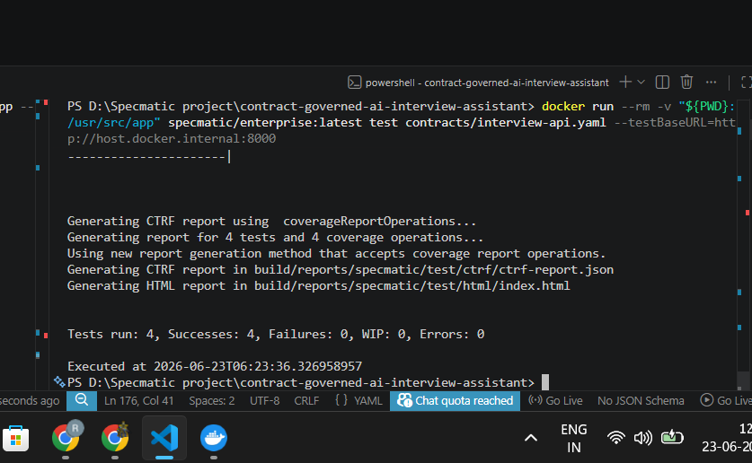
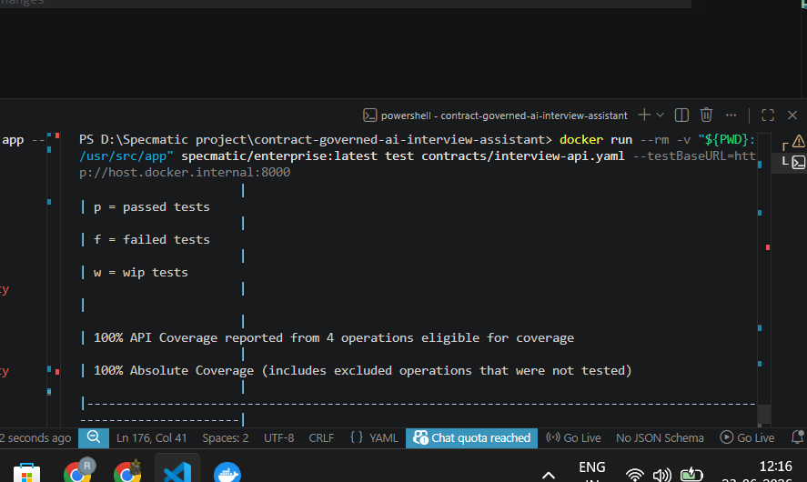

# Contract-Governed AI Interview Assistant

## Overview

This project demonstrates how executable API contracts improve reliability, reduce integration uncertainty, and act as guardrails for AI-assisted software development.

The application is a full-stack AI Interview Assistant built using:

- React (Frontend)
- FastAPI (Backend)
- OpenAPI (API Contract)
- Specmatic (Contract Validation, Contract Testing, Service Virtualization, API Coverage, and Governance)

The OpenAPI contract serves as the single source of truth for frontend and backend development.

---

# Problem Statement

AI coding assistants can generate working code rapidly, but they can also introduce implementation drift from agreed API contracts.

Common issues include:

- Incorrect field names
- Missing required properties
- Unexpected response structures
- Integration failures discovered late in development
- Increased debugging effort

Without executable contracts, these issues are often detected only during integration testing or production.

---

# Solution

This project follows a Contract-First Development approach.

The API is defined using OpenAPI and treated as the source of truth.

Specmatic is used to:

- Validate the OpenAPI specification
- Generate executable mock services
- Enable frontend development before backend completion
- Verify backend implementation against the contract
- Generate API coverage reports
- Produce HTML and CTRF reports
- Improve API robustness through stronger schema validation

---

# Architecture

The OpenAPI contract acts as the single source of truth for both frontend and backend development.

Instead of treating documentation as an afterthought, the contract drives implementation, validation, testing, and integration.


```text
React Frontend
       |
       v
OpenAPI Contract (Source of Truth)
       |
       +-------------------+
       |                   |
       v                   v
Specmatic Mock      Contract Validation
       |                   |
       +-------------------+
               |
               v
          FastAPI Backend
```

---

# Project Structure


```text
contract-governed-ai-interview-assistant
│
├── backend
├── frontend
├── contracts
│   └── interview-api.yaml
│
├── docs
│
├── .github
│   └── workflows
│       └── specmatic.yml
│
├── specmatic.yaml
│
└── README.md
```

---

# Specmatic Configuration

The project includes a **Specmatic configuration file** located at the repository root.

```text
specmatic.yaml
```

The configuration defines:

- OpenAPI contract source
- System Under Test (FastAPI backend)
- HTML report generation
- CTRF report generation

The OpenAPI contract used by Specmatic is located at:

```text
contracts/interview-api.yaml
```

---

# API Contract

Location

```text
contracts/interview-api.yaml
```

## Generate Interview Questions

POST `/generate-questions`

Request

```json
{
  "role": "Machine Learning Engineer"
}
```

Response

```json
{
  "questions": [
    "What is supervised learning?",
    "Explain overfitting.",
    "What is feature engineering?"
  ]
}
```

---

## Evaluate Answer

POST `/evaluate-answer`

Request

```json
{
  "question": "What is supervised learning?",
  "answer": "A machine learning technique where models learn from labeled data."
}
```

Response

```json
{
  "score": 8,
  "feedback": "Good technical explanation."
}
```

---

# Running the Backend

```bash
cd backend
pip install -r requirements.txt
uvicorn main:app --reload
```

Swagger UI

```text
http://localhost:8000/docs
```


---

# Running the Frontend

```bash
cd frontend
npm install
npm start
```

Application

```text
http://localhost:3000
```


---

# OpenAPI Contract Validation

Validate the specification

```bash
docker run --rm \
-v "${PWD}:/usr/src/app" \
specmatic/enterprise:latest \
validate \
--spec-file=contracts/interview-api.yaml
```

Validation confirms:

- OpenAPI Specification
- Request Schemas
- Response Schemas
- Inline Examples
- Global Example Validation

# Contract Testing

Start the FastAPI backend:

```bash
cd backend
uvicorn main:app --reload
```

Run Specmatic contract tests:

```bash
docker run --rm \
-v "${PWD}:/usr/src/app" \
specmatic/enterprise:latest \
test contracts/interview-api.yaml \
--testBaseURL=http://host.docker.internal:8000
```

## Contract Test Execution


---

## Contract Test Results

The backend implementation was validated against the OpenAPI contract using Specmatic.

### Results

- Tests Run: **4**
- Successes: **4**
- Failures: **0**
- Errors: **0**
- API Coverage: **100%**

Covered Scenarios:

- POST `/generate-questions` → **200**
- POST `/generate-questions` → **422**
- POST `/evaluate-answer` → **200**
- POST `/evaluate-answer` → **422**

All contract scenarios passed successfully.

---

## Contract Test Report


---

## Final Contract Test Results



---

## API Coverage



Specmatic reported **100% API Coverage**, confirming that every operation defined in the OpenAPI contract was exercised during contract testing.

| Endpoint | Method | Coverage |
|----------|--------|----------|
| /generate-questions | POST | 100% |
| /evaluate-answer | POST | 100% |

---

# Generated Reports

Specmatic automatically generated the following reports after successful execution:

```text
build/reports/specmatic/test/html/index.html

build/reports/specmatic/test/ctrf/ctrf-report.json
```

Generated report formats:

- HTML Report
- CTRF Report

These reports provide API coverage information, executed scenarios, and test summaries.

---

# Service Virtualization

Specmatic can generate executable mock services directly from the OpenAPI contract.

Run the mock server:

```bash
docker run --rm \
-p 8000:8000 \
-v "${PWD}:/usr/src/app" \
specmatic/enterprise:latest \
mock contracts/interview-api.yaml \
--port 8000
```

Benefits:

- Independent frontend development
- Parallel frontend and backend implementation
- Faster development cycle
- Consistent API behaviour
- Reduced integration bottlenecks

The React frontend was developed and tested against the generated mock before backend completion.

---

# Validation Improvements

While validating the API using Specmatic, several opportunities to strengthen the contract were identified.

The original contract was intentionally simple and focused on functionality.

After validation, the contract was enhanced by introducing stronger schema constraints.

Improvements included:

- Added `minLength`
- Added `maxLength`
- Added `minimum`
- Added `maximum`
- Added required response properties
- Added `additionalProperties: false`

These improvements make the API contract more explicit, easier to validate, and more resilient.

---

# Validation Response Mismatch

One of the most useful findings came from contract testing.

Initially, the OpenAPI contract documented validation failures as **HTTP 400** responses.

However, FastAPI (through Pydantic) automatically returned **HTTP 422 – Unprocessable Entity** whenever request validation failed.

Although the backend worked correctly, the implementation no longer matched the API contract.

Specmatic immediately detected this mismatch during contract testing.

### Fix Applied

- Updated the OpenAPI contract to document HTTP **422** responses.
- Added matching request and response examples.
- Updated validation constraints.
- Re-ran contract validation.

### Result

- Coverage increased from **50%** to **100%**.
- All four contract scenarios passed successfully.
- The contract accurately reflects implementation behaviour.


