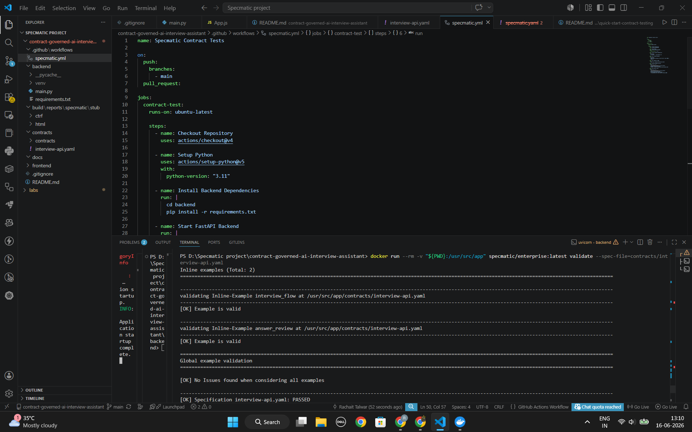
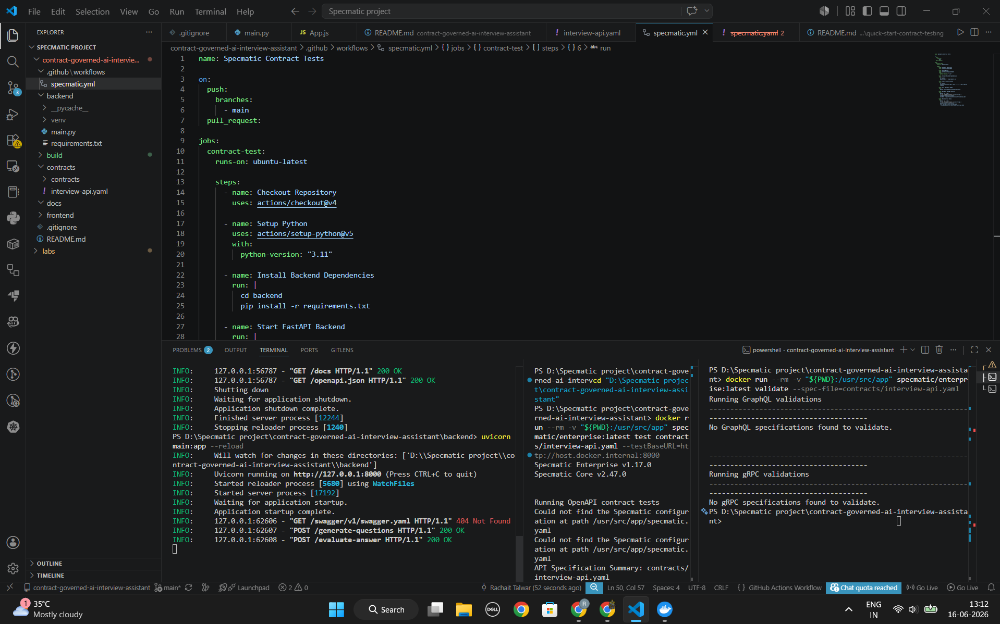
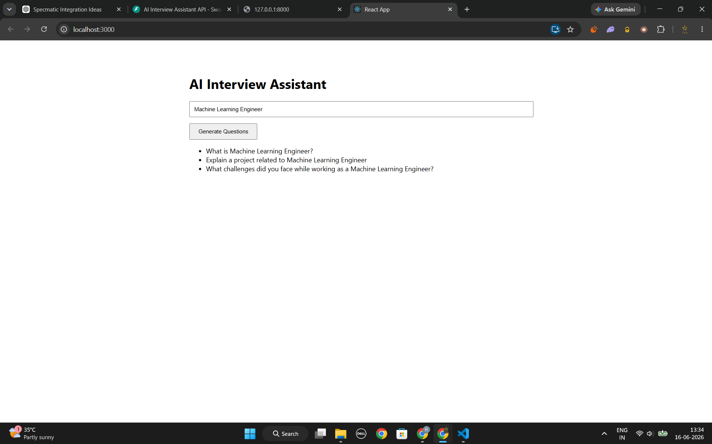
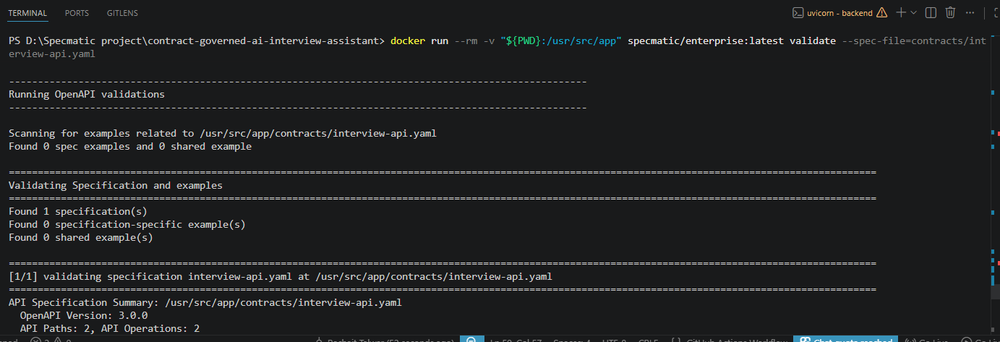
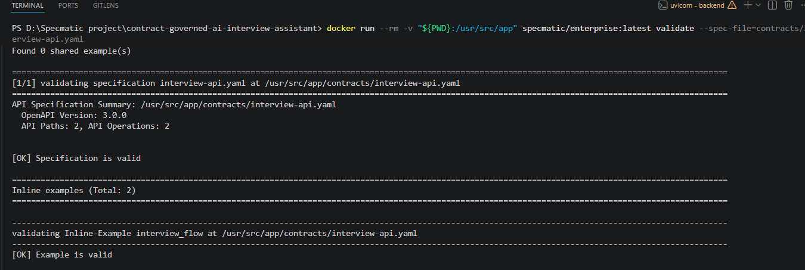
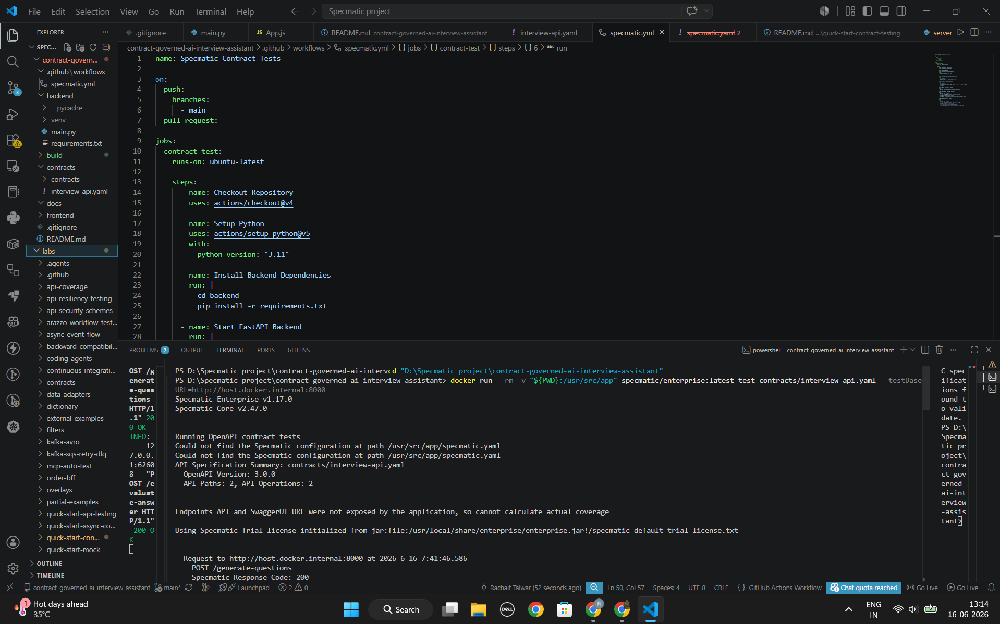
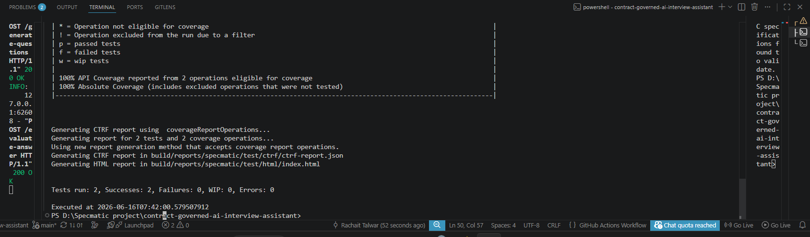
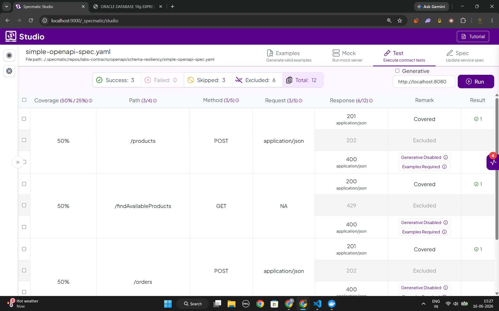
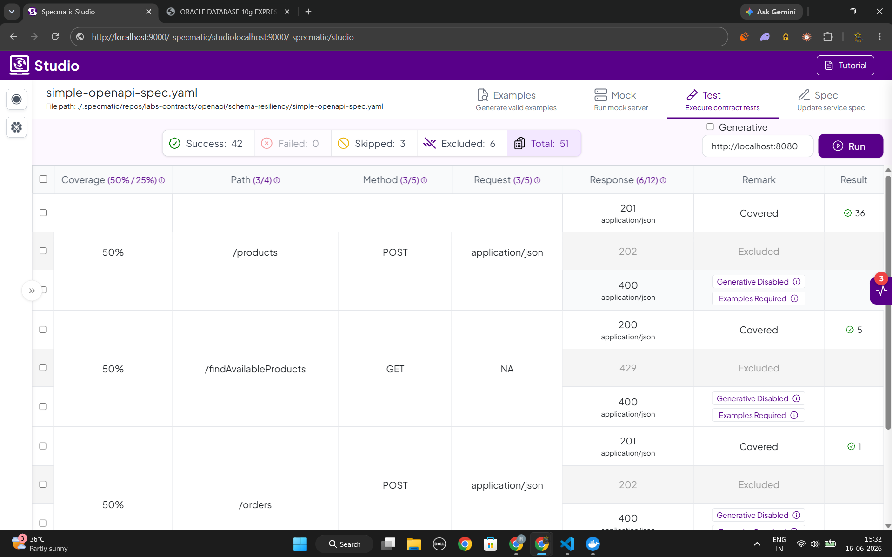
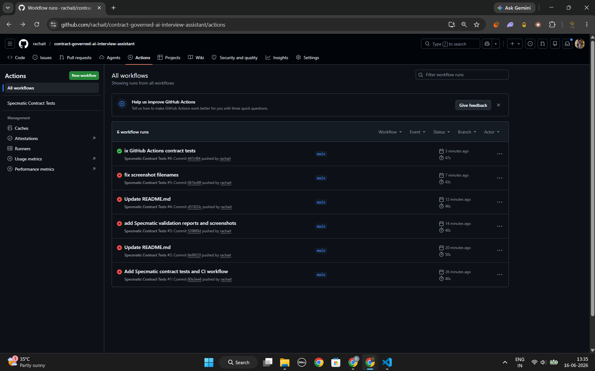

# Contract-Governed AI Interview Assistant

## Overview

This project demonstrates how executable API contracts improve reliability, reduce integration uncertainty, and act as guardrails for AI-assisted software development.

The application is a full-stack AI Interview Assistant built using:

- React (Frontend)
- FastAPI (Backend)
- OpenAPI (API Contract)
- Specmatic (Contract Testing, Validation, Service Virtualization, and Schema Resiliency Testing)

The OpenAPI contract serves as the single source of truth for both frontend and backend development.

---

## Problem Statement

AI coding assistants can generate working code rapidly, but they can also introduce implementation drift from agreed API contracts.

Common issues include:

- Incorrect field names
- Missing required properties
- Unexpected response structures
- Integration failures discovered late in development
- Increased debugging effort

Without executable contracts, these issues are often detected only during integration testing or production.

---

## Solution

This project follows a Contract-First Development approach.

The API is defined using OpenAPI and treated as the source of truth.

Specmatic is used to:

- Generate executable mocks from the contract
- Enable frontend development before backend completion
- Validate implementation behavior against the contract
- Detect contract violations before integration testing
- Generate API coverage reports
- Perform schema resiliency testing
- Act as guardrails for API quality

---

## Architecture

```text
React Frontend
       |
       v
OpenAPI Contract (Source of Truth)
       |
       +-------------------+
       |                   |
       v                   v
Specmatic Mock      Contract Validation
       |                   |
       +-------------------+
               |
               v
          FastAPI Backend
```

The OpenAPI specification acts as the single source of truth and drives development, testing, validation, and integration.

---

## Project Structure



---

## API Contract

Location:

```text
contracts/interview-api.yaml
```

### Generate Interview Questions

**POST /generate-questions**

Request:

```json
{
  "role": "Machine Learning Engineer"
}
```

Response:

```json
{
  "questions": [
    "What is supervised learning?",
    "Explain overfitting.",
    "What is feature engineering?"
  ]
}
```

### Evaluate Answer

**POST /evaluate-answer**

Request:

```json
{
  "question": "What is supervised learning?",
  "answer": "A machine learning technique where models learn from labeled data."
}
```

Response:

```json
{
  "score": 8,
  "feedback": "Good technical explanation."
}
```

---

## Running the Backend

```bash
cd backend
pip install -r requirements.txt
uvicorn main:app --reload
```

Swagger UI:

```text
http://localhost:8000/docs
```

### Backend Running



---

## Running the Frontend

```bash
cd frontend
npm install
npm start
```

Application:

```text
http://localhost:3000
```

### React Application



---

## OpenAPI Contract Validation

Validate the specification:

```bash
docker run --rm -v "${PWD}:/usr/src/app" specmatic/enterprise:latest validate --spec-file=contracts/interview-api.yaml
```

### Validation Results

- OpenAPI Specification: Valid
- API Paths: 2
- API Operations: 2
- Example Validation: Passed

### Specification Validation



### Example Validation



---

## Contract Testing

Start FastAPI:

```bash
cd backend
uvicorn main:app --reload
```

Run contract tests:

```bash
docker run --rm -v "${PWD}:/usr/src/app" specmatic/enterprise:latest test contracts/interview-api.yaml --testBaseURL=http://host.docker.internal:8000
```

### Contract Test Execution



### Results

- Tests Run: 4
- Successes: 4
- Failures: 0
- Errors: 0
- API Coverage: 100%

Covered Endpoints:

- POST /generate-questions (200)
- POST /generate-questions (422)
- POST /evaluate-answer (200)
- POST /evaluate-answer (422)

### Contract Test Report



---

## Schema Resiliency Testing

Beyond standard contract testing, Specmatic was used to explore Schema Resiliency Testing.

This feature automatically generates additional test combinations from the API schema and validates implementation behavior against them.

### How to Toggle Schema Resiliency Tests

Configuration file:

```text
labs/schema-resiliency-testing/specmatic.yaml
```

Baseline:

```yaml
test:
  resiliencyTests: none
```

Positive Only:

```yaml
test:
  resiliencyTests: positiveOnly
```

Full Resiliency Testing:

```yaml
test:
  resiliencyTests: all
```

Run:

```bash
docker compose up --abort-on-container-exit
```

### Baseline Testing

Results:

- Tests run: 3
- Successes: 3
- Failures: 0



### Positive-Only Testing

Results:

- Tests run: 42
- Successes: 42
- Failures: 0



## Findings and Improvements

While exploring schema resiliency testing, I discovered that the original API contract was overly permissive.

Issues identified:

- Missing minimum string length constraints
- Missing response field requirements
- Missing numeric range validation
- Response schemas allowing unexpected properties
- Contract defined validation failures as HTTP 400 while FastAPI returned HTTP 422

Improvements applied:

- Added `minLength`
- Added `maxLength`
- Added `minimum`
- Added `maximum`
- Added required response fields
- Added `additionalProperties: false`
- Added stronger FastAPI validation using Pydantic Field constraints
- Updated OpenAPI contract to accurately document HTTP 422 validation responses
- Added matching request and response examples

These improvements make the contract more robust and self-documenting.

---

## API Coverage

| Endpoint | Method | Coverage |
|----------|---------|----------|
| /generate-questions | POST | 100% |
| /evaluate-answer | POST | 100% |

### Overall Coverage

**100% API Coverage**

This confirms that every operation defined in the OpenAPI specification has been exercised through contract testing.

---

## Generated Reports

Generated artifacts:

```text
build/reports/specmatic/test/ctrf/ctrf-report.json
build/reports/specmatic/test/html/index.html
```

Generated report types:

- CTRF Report
- HTML Report

---

## Service Virtualization with Specmatic

Specmatic generates executable mocks directly from the OpenAPI contract.

Start Mock Server:

```bash
docker run --rm -p 8000:8000 -v "${PWD}:/usr/src/app" specmatic/enterprise:latest mock contracts/interview-api.yaml --port 8000
```

Benefits:

- Frontend development without backend dependency
- Faster parallel development
- Reduced integration bottlenecks
- Consistent API behavior across teams

The React frontend was developed and tested independently using the generated mock service before backend completion.

---

## Continuous Integration

Contract validation has been automated using GitHub Actions.

Workflow Location:

```text
.github/workflows/specmatic.yml
```

The CI pipeline performs:

- OpenAPI Validation
- Example Validation
- Contract Testing
- Schema Resiliency Testing
- Contract Compliance Verification

### GitHub Actions Workflow



---

## Issues Identified and Fixed Using Specmatic

### Missing Example Pairings

Initial validation reported warnings because request examples did not have matching response examples.

#### Fix

Added corresponding request and response examples in the OpenAPI specification.

### Validation Response Mismatch

Specmatic identified a mismatch between the OpenAPI contract and FastAPI implementation.

The contract initially documented validation failures as HTTP 400 responses.

FastAPI and Pydantic automatically returned HTTP 422 responses for schema validation failures.

#### Fix

- Updated the OpenAPI contract to document HTTP 422 responses
- Added request and response validation examples
- Re-ran contract validation and testing

#### Result

- Coverage improved from 50% to 100%
- All contract tests passed successfully

### Schema Validation Findings

Schema resiliency analysis highlighted weaknesses in the original contract and motivated stronger schema constraints and validation rules.

#### Improvements Applied

- Added `minLength` and `maxLength` constraints
- Added required response fields
- Added numeric validation (`minimum` and `maximum`)
- Added `additionalProperties: false`
- Updated FastAPI request validation using Pydantic `Field`

### Key Takeaway

The most valuable aspect of executable contracts was not intentionally introducing failures.

Instead, Specmatic helped uncover real specification, validation, and integration issues early in development before they could become production problems.

---

## Key Learnings

- Executable contracts reduce integration uncertainty.
- API contracts provide clear boundaries between services.
- Service virtualization enables independent frontend and backend development.
- Contract-first development catches issues earlier.
- Schema resiliency testing increases confidence in API robustness.
- OpenAPI examples improve test quality and documentation.
- Automated validation improves confidence in API behavior.
- Specmatic acts as a practical guardrail for API development.

---

## Future Improvements

- Gemini/OpenAI-powered interview question generation
- AI-powered answer evaluation
- Persistent interview history
- User authentication
- Interview analytics dashboard
- Advanced scoring and recommendations

---

## Author

**Rachait Talwar**

Submission for the **Specmatic Full Stack AI Engineering Intern / Trainee Challenge**.

Built to demonstrate how executable contracts improve API quality through:

- Contract Validation
- Example Validation
- Service Virtualization
- Contract Testing
- Schema Resiliency Testing
- API Coverage Reporting
- CI Automation
